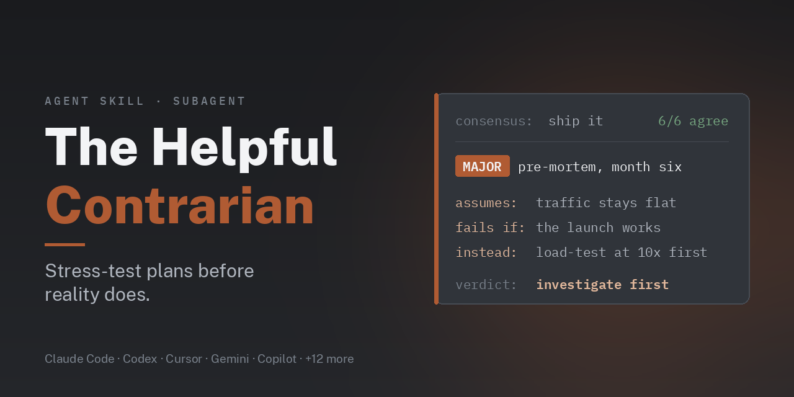

<p align="center">
  
</p>

<p align="center">
  <strong>Contrarian</strong><br>
  <em>A devil's advocate for coding agents. It stress-tests plans before reality does.</em>
</p>

<p align="center">
  <a href="UNLICENSE"></a>
  <a href=".github/workflows/checks.yml"></a>
  <a href=".github/workflows/plugin-load-check.yml"></a>
</p>

<p align="center">
  <a href="https://www.linkedin.com/in/aaddrick/">Connect on LinkedIn!</a>
</p>

When everyone agrees on a plan, your coding agent agrees too. Contrarian's job is to assume the consensus is wrong and find out what that world looks like. It steel-mans the proposal first, audits the unstated assumptions, runs a pre-mortem, and checks each objection before it calls it serious.

Use it for pre-mortems, architecture reviews, decision validation, or "should we even do this?" questions. It also works on plans that have nothing to do with code. It isn't a code reviewer: it challenges strategy, approach, and hidden risks.

It ships two ways. Claude Code gets a `contrarian` subagent and a `contrarian` skill. Every other harness gets the skill, which tells the agent to run the analysis in a fresh subagent when it can. It installs in Claude Code, Claude Desktop and claude.ai, Codex, Antigravity CLI, Cursor, Devin CLI, Factory Droid, Gemini CLI, GitHub Copilot CLI, Grok Build CLI, Hermes Agent, Kimi Code, OpenCode, Pi, Qwen Code, Muse, and Muse Code.

## Install

<details>
<summary><strong>Claude Code</strong></summary>

```bash
claude plugin marketplace add aaddrick/contrarian
```

```bash
claude plugin install contrarian@contrarian
```

This adds the `contrarian:contrarian` subagent and the `contrarian:contrarian` skill. Ask Claude to "run the contrarian agent on this plan", or load the skill by hand:

```
/contrarian:contrarian
```

To skip the plugin and keep only the subagent, copy the agent file into your user or project agents folder:

```bash
curl -fsSL --create-dirs -o ~/.claude/agents/contrarian.md https://raw.githubusercontent.com/aaddrick/contrarian/main/.claude/agents/contrarian.md
```

</details>

<details>
<summary><strong>Claude Desktop, Cowork, and claude.ai</strong></summary>

**Step 1.** Open **Customize > Plugins**, select **Add**, then **Add marketplace**.

**Step 2.** Choose **Add from a repository**.

**Step 3.** Enter `aaddrick/contrarian`. Leave **Sync automatically** on so the plugin updates when this repository does. Then select **Sync**.

**Step 4.** Select **Add** next to **Contrarian**.

**Step 5.** Claude confirms the plugin is installed. It also appears in the desktop app and Cowork on the same account.

</details>

<details>
<summary><strong>Codex CLI and Codex app</strong></summary>

Add the marketplace and install the plugin:

```bash
codex plugin marketplace add aaddrick/contrarian
```

```bash
codex plugin add contrarian@contrarian
```

Check that it installed:

```bash
codex plugin list
```

The Codex app reads the same Codex config, so the plugin shows up there too. Open **Plugins** in the sidebar to see it.

Start a new thread. Codex loads the skill when the task matches. To load it by hand, type:

```
$contrarian:contrarian
```

</details>

<details>
<summary><strong>Antigravity CLI</strong></summary>

```bash
agy plugin install https://github.com/aaddrick/contrarian
```

Check that it installed:

```bash
agy plugin list
```

Start a new session. Antigravity CLI loads the skill when the task matches. To load it by hand, type:

```
/contrarian:contrarian
```

Coming from Gemini CLI? If `agy plugin import gemini` brought this extension over, run the install command above anyway so the current copy replaces the imported one.

</details>

<details>
<summary><strong>Cursor</strong></summary>

In Cursor Agent chat, type:

```
/add-plugin https://github.com/aaddrick/contrarian
```

Or open **Customize**, import a plugin **From GitHub Repository**, and enter `https://github.com/aaddrick/contrarian`. Then select **Install** next to **Contrarian** and choose project or user scope.

A plugin added from a GitHub URL can get stuck on an old commit. For dependable updates, clone the repository into Cursor's local plugin folder instead:

```bash
git clone https://github.com/aaddrick/contrarian.git ~/.cursor/plugins/local/contrarian
```

Then run **Developer: Reload Window**. Clone into that folder, don't symlink to it: Cursor skips symlinks that point outside it. To update, run `git pull` there and reload again.

Check that it installed: open **Customize**, then **Skills**. `contrarian` appears under **Agent Decides**.

Cursor loads the skill when the task matches. To load it by hand, type:

```
/contrarian
```

</details>

<details>
<summary><strong>Devin CLI</strong></summary>

Devin needs a signed-in account to manage plugins. If you are not signed in yet, run `devin auth login` first.

```bash
devin plugins install aaddrick/contrarian
```

Check that it installed:

```bash
devin plugins info contrarian
```

Start a new session. Devin loads the skill when the task matches. To load it by hand, type:

```
/contrarian:contrarian
```

To update it later:

```bash
devin plugins update contrarian
```

</details>

<details>
<summary><strong>Factory Droid</strong></summary>

```bash
droid plugin marketplace add https://github.com/aaddrick/contrarian
```

```bash
droid plugin install contrarian@contrarian
```

Check that it installed:

```bash
droid plugin list
```

In a Droid session, run `/skills` and open the Plugins tab to see the skill. Droid loads it when the task matches. To load it by hand, type `/contrarian` at the start of a prompt.

To update it later:

```bash
droid plugin marketplace update contrarian
droid plugin update contrarian@contrarian
```

</details>

<details>
<summary><strong>Gemini CLI</strong></summary>

```bash
gemini extensions install https://github.com/aaddrick/contrarian
```

Check that it installed:

```bash
gemini extensions list
```

The output lists `contrarian` under **Agent skills**. Start a new session. Gemini CLI loads the skill when the task matches and asks you to approve it first. To load it by hand, ask Gemini to use the `contrarian` skill.

To update it later:

```bash
gemini extensions update contrarian
```

</details>

<details>
<summary><strong>GitHub Copilot CLI</strong></summary>

```bash
copilot plugin marketplace add aaddrick/contrarian
```

```bash
copilot plugin install contrarian@contrarian
```

Check that it installed:

```bash
copilot skill list
```

`contrarian` shows under "Plugin skills". Copilot loads it when the task matches. To load it by hand, ask Copilot to use the `contrarian` skill.

</details>

<details>
<summary><strong>Grok Build CLI</strong></summary>

```bash
grok plugin install aaddrick/contrarian --trust
```

Check that it installed:

```bash
grok inspect
```

`contrarian` appears under Skills. Start a new session. Grok loads the skill when the task matches. To load it by hand, type:

```
/contrarian
```

</details>

<details>
<summary><strong>Hermes Agent</strong></summary>

```bash
hermes skills install aaddrick/contrarian/skills/contrarian
```

Check that it installed:

```bash
hermes skills list
```

Start a new session. Hermes loads the skill when the task matches. To load it by hand, type:

```
/contrarian
```

You can install it as a plugin instead, with `hermes plugins install aaddrick/contrarian --enable`. A plugin skill does not load on its own, though: you have to ask Hermes to load the `contrarian` skill each time. The `skills install` route above does not have that limit.

</details>

<details>
<summary><strong>Kimi Code</strong></summary>

Inside Kimi Code, type:

```
/plugins install https://github.com/aaddrick/contrarian
```

Start a new session so the skill loads:

```
/new
```

Check that it installed. The plugin shows as enabled with no errors:

```
/plugins info contrarian
```

Kimi loads the skill when the task matches. To load it by hand, type:

```
/skill:contrarian
```

</details>

<details>
<summary><strong>OpenCode</strong></summary>

OpenCode loads skills from `~/.config/opencode/skills/` on its own. Clone this repository and link the skill folder there:

```bash
git clone https://github.com/aaddrick/contrarian.git ~/.local/share/contrarian
mkdir -p ~/.config/opencode/skills
ln -s ~/.local/share/contrarian/skills/contrarian ~/.config/opencode/skills/contrarian
```

On Windows, copy the folder instead of linking it.

Check that it installed:

```bash
opencode debug skill | grep '"name": "contrarian"'
```

Restart OpenCode. It loads the skill when the task matches. To load it by hand, ask it to use the skill tool to load `contrarian`.

To update, run `git -C ~/.local/share/contrarian pull`.

</details>

<details>
<summary><strong>Pi</strong></summary>

```bash
pi install https://github.com/aaddrick/contrarian
```

Check that it installed:

```bash
pi list
```

Start a new session. Pi loads the skill when the task matches. To load it by hand, type:

```
/skill:contrarian
```

</details>

<details>
<summary><strong>Qwen Code</strong></summary>

```bash
qwen extensions install https://github.com/aaddrick/contrarian:contrarian
```

The `:contrarian` suffix picks the plugin. Leave it off and Qwen asks you to pick one.

Check that it installed:

```bash
qwen extensions list
```

`contrarian` appears under `Skills:`. Restart Qwen Code. It loads the skill when the task matches. To load it by hand, type:

```
/contrarian:contrarian
```

To update it later:

```bash
qwen extensions update contrarian
```

</details>

<details>
<summary><strong>Muse (muse.ai)</strong></summary>

Muse loads skills from `~/workspace/skills/` on its own computer. Paste this command into a Muse chat and ask Muse to run it:

```bash
curl -fsSL https://raw.githubusercontent.com/aaddrick/contrarian/main/scripts/install_muse.sh | bash
```

The script copies the skill folder there and rewrites the `SKILL.md` header into the shape Muse reads. Start a new chat. Muse loads the skill when the task matches. To update, run the command again.

</details>

<details>
<summary><strong>Muse Code</strong></summary>

Clone the repository:

```bash
git clone https://github.com/aaddrick/contrarian.git
```

Install the skill for every project:

```bash
muse skills install contrarian/skills/contrarian --scope user
```

Check that it installed:

```bash
muse skills list
```

Start a new session. Muse Code loads the skill when the task matches. To load it by hand, type:

```
/skill contrarian
```

To install it as a plugin instead, turn on Muse Code's experimental plugins first. Plugins are off by default in Muse Code 1.4.2.

```bash
export MUSE_EXPERIMENTAL_PLUGINS=1
muse plugins marketplace add contrarian aaddrick/contrarian
muse plugins install contrarian@contrarian
```

</details>

<details>
<summary><strong>Any other agent that reads SKILL.md</strong></summary>

Copy the `skills/contrarian/` folder into your agent's skills folder.

</details>

## What it does

It scales its depth to the stakes. A minor, easily reversed change gets a light pass that looks only for major blind spots. A significant feature gets a full assumption audit. An architecture, infrastructure, or security change gets everything, including a pre-mortem.

It works through five moves, most relevant first:

1. **Steel-man.** Restate the proposal fairly and list its real strengths before any criticism.
2. **Assumption audit.** List every unstated assumption and rate each by how likely it is to be wrong and what it costs if it is. Ignore the cheap ones.
3. **Pre-mortem.** Assume the plan has already failed. Which assumption broke first, and what warning signs were missed?
4. **Inversion.** For each key decision, ask what happens if you did the opposite, or nothing.
5. **Second-order effects.** What happens after what happens, and who else is affected?

Every finding carries a severity, the assumption it challenges, a concrete failure scenario, and the impact. It adds a recommendation when it has a real one, and leaves it out rather than padding it. Severity has to be earned:

- **Critical:** serious harm that is hard or impossible to undo, such as lost data, a security, legal or safety exposure, or money or trust you can't get back.
- **Major:** the plan fails at its own goal.
- **Minor:** everything else.

It calls something Critical or Major only after checking that the failure path is real, and it says what it checked. The analysis ends with one verdict: **Sound with caveats** (only when no Critical or Major finding remains), **Needs rework**, or **Investigate first**. A clean result with no serious findings is a normal outcome, not a failure to find something.

The rules it holds itself to: name a concrete failure mode, no vague doom, no straw-manning, and say so when the consensus is right. Always disagreeing is as biased as always agreeing. If you hand it decisions that were already settled, it reopens one only with new evidence.

## What is inside

| File | What it is |
|---|---|
| `.claude/agents/contrarian.md` | The subagent. This is the source text. |
| `skills/contrarian/SKILL.md` | The skill: a one-line note on running it in a subagent, then the agent's text word for word |
| `poster/the-helpful-contrarian.pdf` | A one-page desk reference ([source](poster/the-helpful-contrarian.tex)) |

`scripts/check_configs.py` fails if the skill and the agent drift apart.

## Customizing the delegation section

The **Scope > Not in scope** section names which concerns the contrarian hands off to other specialists. It ships with broad categories:

```markdown
**Not in scope** (defer to specialists):
- Code review, style, or formatting → code review agents
- Implementation details → domain-specific developer agents
- Infrastructure specifics → infrastructure/platform agents
```

I'd recommend customizing this per project to point at the agents you have. In a Laravel + GCP project it might look like this:

```markdown
**Not in scope** (defer to specialists):
- Code quality, style, or formatting → `code-reviewer`
- Spec/requirements compliance → `spec-reviewer`
- CSS/frontend implementation → `bulletproof-frontend-developer`
- PHP/Laravel implementation details → `laravel-backend-developer`
- GCP infrastructure specifics → `gcp-architect`
```

That keeps the contrarian on assumptions and strategy, and routes implementation concerns to agents with the domain context for them. To customize it, copy the agent file into the project's `.claude/agents/` and edit it there.

## Using it as a gate in a pipeline

An adversary with no stopping rule will re-litigate decisions you already made, and it'll burn your most expensive model doing it. In one early run, it spent about five Opus iterations bouncing on the same call across two gates. Each fresh contrarian instance saw only digests, and nothing told it the trade-off was already settled, so it kept reopening it in good faith.

What worked:

- **Cap the iterations.** Three challenge rounds per gate, two for a trivial change: one challenge, one revision, one re-check.
- **Keep a settled ledger.** Carry decisions forward, and pass them to every later gate. A gate can reopen a settled decision only by citing concrete new evidence that wasn't on the table when it was decided. The agent follows this rule when it's given the ledger.
- **Treat findings as hypotheses.** The agent that revises the plan should check each finding against the real state before acting on it, and argue back with evidence when it's wrong. Gates oscillate when a wrong Major is adopted without anyone checking it.
- **Let it read the full record.** Give the contrarian the whole trail, not just a summary, and treat an earlier ruling at any gate as already decided.
- **Make the cap visible.** When a gate hits its cap with Critical or Major findings still open, carry them forward and flag them for a human. Don't let the pipeline move on quietly.

[ticketmill](https://github.com/aaddrick/ticketmill) runs it this way, at an approach gate and a plan gate.

## Contributing

See [CONTRIBUTING.md](CONTRIBUTING.md). Corrections and new anti-patterns are welcome, especially ones that come with the proposal that exposed them.

## Credits

Built on the Contrarian agent from [Ouroboros](https://github.com/Q00/ouroboros/blob/c382052bab636d4139619f0ade5d5fe5c7ec66d5/src/ouroboros/agents/contrarian.md). The original is a lightweight assumption-challenging framework. This version adds structured output (steel-man, severity-rated findings, verdicts), anti-patterns to avoid, and calibration that scales the analysis to the stakes.

Multi-harness packaging follows the approach of [obra/superpowers](https://github.com/obra/superpowers).

## License

Public domain. See [UNLICENSE](UNLICENSE).
